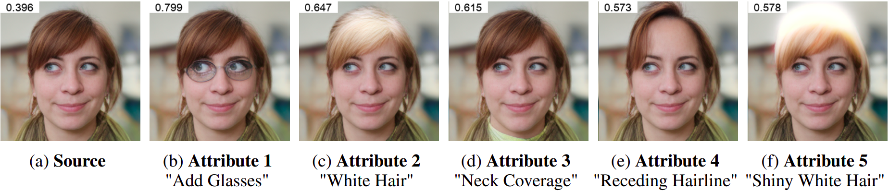
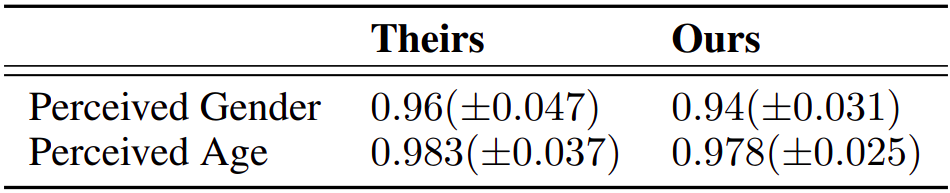
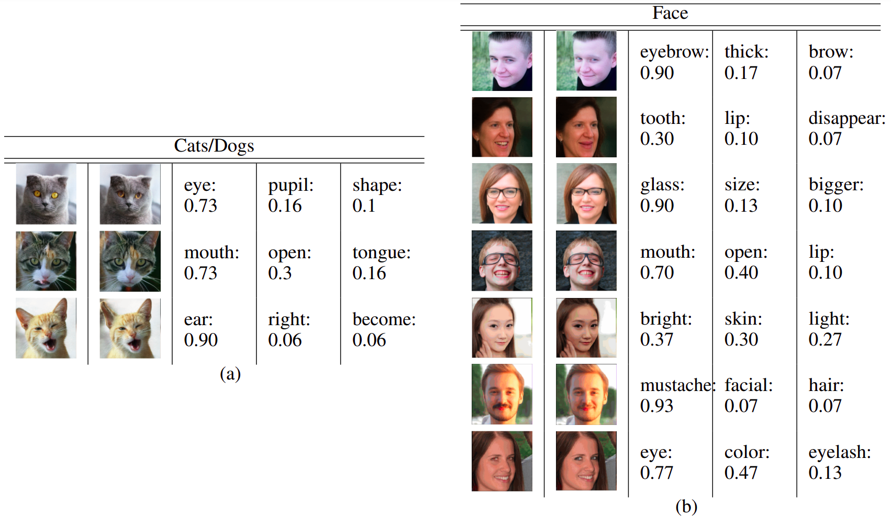

# Reproducibility study for "Explaining in Style: Training a GAN to explain a classifier in StyleSpace"

This repository contains our experiments in reproducing Lang et.al's  ["Explaining in Style: Training a GAN to explain a classifier in StyleSpace"](https://arxiv.org/abs/2104.13369).

Original Paper Material: [Website](https://explaining-in-style.github.io/) [GitHub](https://github.com/google/explaining-in-style)


## Requirements

If case you want to run our code locally, you need to activate the following environment in anaconda.

We **strongly** recommend running both our notebooks in Colab, since this is the environment we used.

```setup
conda env create -f environment.yml
```


## Training

To train our implementation of the StylEx model in the PyTorch, run the ```StylEx.ipynb``` (inside train folder) notebook:

[](https://colab.research.google.com/github/irenepap2/FACT_UvA_2022/blob/main/train/StylEx.ipynb)


## Pre-trained Models

To save time we provide our pre-trained models and ```.py``` files needed in a ```.zip``` file in Google Drive and load them in the following Colab notebook to reproduce our results.


## Results

To **reproduce the results shown in our paper**, run the ```Att_Find.ipynb``` notebook:

[](https://colab.research.google.com/github/irenepap2/FACT_UvA_2022/blob/main/Attr_Find.ipynb)

<p align="center">
  <b>Top 4 attributes for the perceived age classifier</b><br>
  <br><br><br>
  <b>Independent selection strategy - Top-5 detected attributes</b><br>
  <br><br><br>
  <b>Classification study results</b><br>
  <br><br><br>
  <b>Verbal description study results</b><br>
  <br><br><br>
</p>

The files ```legacy_modified.py``` and ```mobilenet_pytorch.py``` can be used to transfer the original paper's pre-trained models from TensorFlow to Pytorch. For this, the pre-trained models provided in the authors' notebook ([GitHub](https://github.com/google/explaining-in-style)) are needed.


## Contributing

All contributions are welcome. All content in this repository is licensed under the MIT license.

[](https://opensource.org/licenses/MIT)


